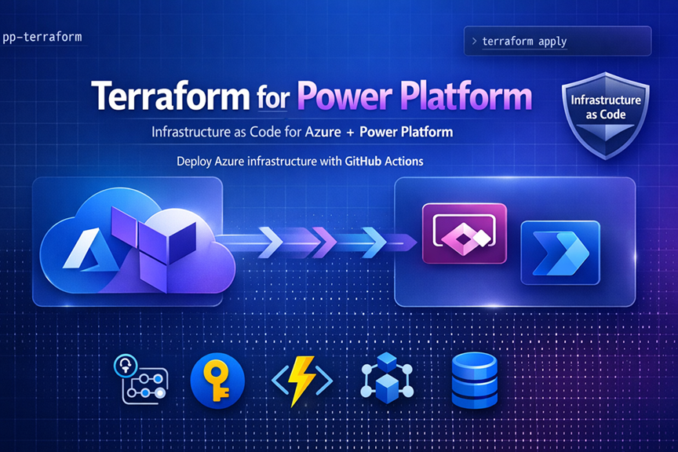

# terraform-power-platform



> Infrastructure as Code for Microsoft Power Platform — Azure resources provisioned and managed with Terraform, deployed via GitHub Actions and Azure DevOps pipelines.

## What This Repo Provisions

| Module | Azure Resource | Purpose |
|--------|---------------|---------|
| `keyvault` | Azure Key Vault | Secrets for custom connectors & flows |
| `storage` | Azure Storage Account + Containers | File handling for Power Automate |
| `function-app` | Azure Function App (Consumption) | Custom connector backend |
| `apim` | Azure API Management | Secure API gateway for Power Apps |
| `app-registration` | Microsoft Entra ID App Registration | Dataverse authentication |

## Quick Start

```bash
# 1. Bootstrap state storage (first time only)
./scripts/bootstrap.sh

# 2. Initialise Terraform for dev
cd terraform
terraform init -backend-config=environments/backend-dev.hcl

# 3. Plan
terraform plan -var-file=environments/dev.tfvars

# 4. Apply
terraform apply -var-file=environments/dev.tfvars
```

## Repository Structure

```
.
├── .github/workflows/          # GitHub Actions CI/CD
├── .azuredevops/               # Azure DevOps pipeline YAML
├── scripts/                    # Bootstrap & utility scripts
├── terraform/
│   ├── main.tf                 # Root module — wires everything together
│   ├── providers.tf            # Provider & backend configuration
│   ├── variables.tf            # Input variable declarations
│   ├── outputs.tf              # Outputs exposed to pipelines
│   ├── environments/           # Per-environment tfvars & backend configs
│   └── modules/                # Reusable child modules
│       ├── keyvault/
│       ├── storage/
│       ├── function-app/
│       ├── apim/
│       └── app-registration/
└── docs/                       # Architecture diagrams & runbooks
```

## Environments

| Environment | State Key | Branch | Approval Required |
|------------|-----------|--------|------------------|
| `dev` | `dev.tfstate` | `feature/*` | No |
| `test` | `test.tfstate` | `main` | No |
| `prod` | `prod.tfstate` | `main` | Yes — manual gate |

## Prerequisites

- Terraform CLI >= 1.5.0
- Azure CLI >= 2.50.0
- Azure subscription (Contributor role)
- GitHub or Azure DevOps account

## Related Article

Full walkthrough: [Terraform for Power Platform Developers — aidevme.com](https://aidevme.com/terraform-azure-power-platform-developers)

## Author

**Zombik** — Senior Power Platform Expert, ELCA Informatik AG  
[aidevme.com](https://aidevme.com) | [LinkedIn](https://linkedin.com)
