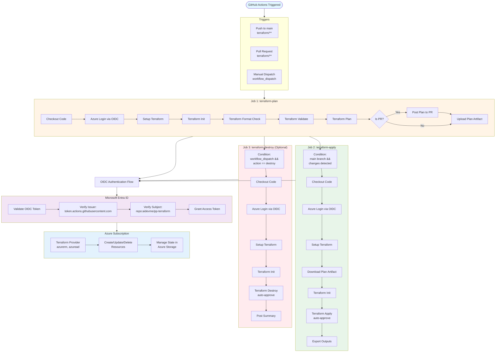
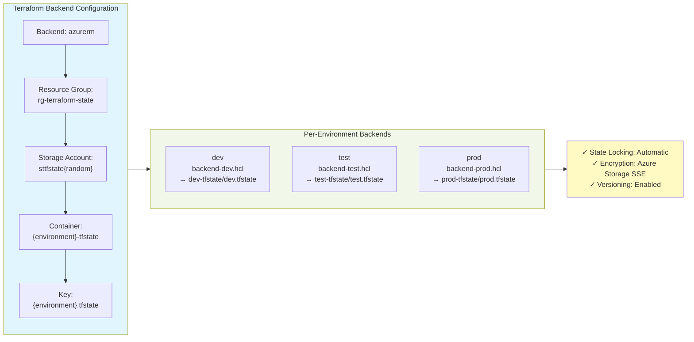

# Architecture Overview

This document describes the complete infrastructure architecture for the Power Platform Terraform solution, including Azure resources, CI/CD pipeline, security model, and data flows.

---

## Table of Contents

- [Resource Map](#resource-map)
- [CI/CD Architecture](#cicd-architecture)
- [Security Architecture](#security-architecture)
- [Module Dependencies](#module-dependencies)
- [Data Flow](#data-flow)
- [Environment Matrix](#environment-matrix)
- [Naming Convention](#naming-convention)

---

## Resource Map

### Azure Resources

```
Azure Subscription
│
├── rg-terraform-state                     Terraform State Storage (Bootstrap)
│   └── st{tfstate}{random}                Storage Account
│       ├── dev-tfstate (container)
│       ├── test-tfstate (container)
│       └── prod-tfstate (container)
│
└── rg-{project}-{environment}             Main Resource Group
    │
    ├── kv-{project}-{environment}          Key Vault (Central Secrets)
    │   ├── Access Policy: Deployer (Service Principal)
    │   │   └── Permissions: Secret (Get, List, Set, Delete, Recover, Purge, Backup, Restore)
    │   ├── Access Policy: Function App Managed Identity
    │   │   └── Permissions: Secret (Get, List)
    │   ├── Access Policy: APIM Managed Identity (if deployed)
    │   │   └── Permissions: Secret (Get, List)
    │   │
    │   └── Secrets:
    │       ├── custom-connector-api-key         (from GitHub Secret)
    │       ├── storage-connection-string        (auto-generated)
    │       ├── connector-client-id              (from App Registration)
    │       ├── connector-client-secret          (from App Registration)
    │       └── apim-subscription-key            (from APIM, if deployed)
    │
    ├── st{project}{environment}            Storage Account
    │   ├── Replication: LRS (dev/test), ZRS (prod)
    │   ├── Versioning: Enabled
    │   ├── Soft Delete: Enabled (retention varies by env)
    │   ├── Containers:
    │   │   ├── uploads (private)
    │   │   ├── processed (private)
    │   │   └── archive (private)
    │   └── Connection String → Key Vault
    │
    ├── asp-{project}-{environment}         App Service Plan
    │   ├── SKU: Y1 (Consumption)
    │   └── OS: Windows
    │
    ├── func-{project}-{environment}        Function App (Conditional)
    │   ├── Runtime: .NET 8.0 (Isolated)
    │   ├── SystemAssigned Managed Identity
    │   │   └── Access: Key Vault (Get, List)
    │   ├── App Settings:
    │   │   ├── APPINSIGHTS_INSTRUMENTATIONKEY
    │   │   ├── APPLICATIONINSIGHTS_CONNECTION_STRING
    │   │   ├── FUNCTIONS_WORKER_RUNTIME = "dotnet-isolated"
    │   │   └── KeyVaultUri = (Key Vault URI)
    │   └── CORS: Power Platform domains
    │
    ├── appi-{project}-{environment}        Application Insights
    │   ├── Type: web
    │   ├── Workspace ID: Auto-assigned (ignored in lifecycle)
    │   └── Linked to Function App
    │
    └── apim-{project}-{environment}        API Management (Conditional)
        ├── SKU: Consumption (dev/test - if enabled), Standard_1 (prod)
        ├── SystemAssigned Managed Identity
        │   └── Access: Key Vault (Get, List)
        ├── APIs: pp-connector-api
        │   └── Backend: Function App
        └── Subscription Key → Key Vault

Microsoft Entra ID (Azure AD)
│
├── Service Principal: GitHub-Actions-OIDC-Terraform
│   ├── Roles:
│   │   ├── Contributor (Subscription)
│   │   ├── Storage Blob Data Contributor (State Storage)
│   │   └── Cloud Application Administrator (Directory Role)
│   └── Federated Credentials:
│       ├── repo:aidevme/pp-terraform:ref:refs/heads/main
│       ├── repo:aidevme/pp-terraform:pull_request
│       ├── repo:aidevme/pp-terraform:environment:dev
│       ├── repo:aidevme/pp-terraform:environment:test
│       └── repo:aidevme/pp-terraform:environment:prod
│
└── App Registration: app-{project}-connector-{environment} (Conditional)
    ├── Display Name: {project}-connector-{environment}
    ├── Client Secret (expires per configuration)
    ├── API Permissions: Dataverse user_impersonation
    ├── Service Principal (auto-created)
    └── Secrets stored in Key Vault:
        ├── connector-client-id
        └── connector-client-secret
```

---

## CI/CD Architecture

### GitHub Actions Workflow



### Terraform State Management



---

## Security Architecture

### Authentication & Authorization Flow

```
┌──────────────────────────────────────────────────────────────────┐
│  1. GitHub Actions → Azure (Deployment)                          │
│                                                                    │
│  GitHub Actions Workflow                                          │
│         │                                                          │
│         │ OIDC Token (Federated Credential)                      │
│         ▼                                                          │
│  Microsoft Entra ID                                               │
│         │                                                          │
│         │ Validates & Issues Access Token                        │
│         ▼                                                          │
│  Service Principal: GitHub-Actions-OIDC-Terraform               │
│         │                                                          │
│         │ Roles: Contributor + Cloud App Admin                   │
│         ▼                                                          │
│  Azure Resources (Create/Update/Delete)                          │
└──────────────────────────────────────────────────────────────────┘

┌──────────────────────────────────────────────────────────────────┐
│  2. Function App → Key Vault (Runtime)                           │
│                                                                    │
│  Azure Function App                                               │
│         │                                                          │
│         │ System-Assigned Managed Identity                       │
│         ▼                                                          │
│  Microsoft Entra ID                                               │
│         │                                                          │
│         │ Issues Managed Identity Token                          │
│         ▼                                                          │
│  Key Vault Access Policy                                         │
│         │                                                          │
│         │ Permissions: Get, List (Secrets)                       │
│         ▼                                                          │
│  Key Vault Secrets (Read-Only Access)                           │
└──────────────────────────────────────────────────────────────────┘

┌──────────────────────────────────────────────────────────────────┐
│  3. App Registration → Dataverse (Custom Connector)              │
│                                                                    │
│  Power Platform Custom Connector                                  │
│         │                                                          │
│         │ OAuth 2.0 (Client ID + Secret from Key Vault)         │
│         ▼                                                          │
│  Microsoft Entra ID                                               │
│         │                                                          │
│         │ Issues Access Token                                    │
│         ▼                                                          │
│  App Registration Service Principal                              │
│         │                                                          │
│         │ API Permission: Dataverse user_impersonation           │
│         ▼                                                          │
│  Dataverse API (Authorized Access)                               │
└──────────────────────────────────────────────────────────────────┘
```

### Key Security Features

| Component | Security Mechanism | Purpose |
|-----------|-------------------|---------|
| **Service Principal** | OIDC Federated Credentials | Passwordless GitHub Actions authentication |
| **Function App** | System-Assigned Managed Identity | Passwordless Key Vault access |
| **APIM** | System-Assigned Managed Identity | Passwordless Key Vault access |
| **Key Vault** | Access Policies | Fine-grained permission control |
| **Storage** | Connection String in Key Vault | Centralized secret management |
| **App Registration** | Client Secret in Key Vault | Secure credential storage |
| **Terraform State** | Azure Storage SSE + Lock | Encryption at rest + concurrency control |
| **Network** | CORS on Function App | Restrict to Power Platform domains |

---

## Module Dependencies

```
┌─────────────────────────────────────────────────────────────────┐
│                         main.tf (Root Module)                    │
└─────────────────────────────────────────────────────────────────┘
        │
        ├── azurerm_resource_group.main
        │
        ├─► MODULE: keyvault ◄─────────────────┐
        │   └── Outputs:                        │
        │       ├── key_vault_id                │ (dependency)
        │       └── key_vault_uri               │
        │                                        │
        ├─► MODULE: storage ───────────────────┤
        │   ├── depends_on: [keyvault]         │
        │   └── Stores connection string in KV  │
        │                                        │
        ├─► MODULE: function-app (conditional) ─┤
        │   ├── depends_on: [keyvault]         │
        │   ├── Uses: storage account           │
        │   ├── Creates: Managed Identity       │
        │   └── Gets KV access policy           │
        │                                        │
        ├─► MODULE: app-registration (conditional)
        │   ├── depends_on: [keyvault]         │
        │   └── Stores secrets in KV            │
        │                                        │
        └─► MODULE: apim (conditional) ─────────┤
            ├── depends_on: [keyvault]         │
            ├── Backends to: function-app      │
            ├── Creates: Managed Identity       │
            └── Stores subscription key in KV   │

Legend:
├─► = creates/manages
◄─ = provides outputs to
└─ = action/details
```

---

## Data Flow

```
Power Automate Flow
    │
    ▼
Custom Connector  ──────────────────────────────────────┐
    │                                                    │
    │ (via subscription key from Key Vault)              │
    ▼                                                    ▼
Azure API Management                         Azure Function App
    │                                              │
    │                                              │ (Managed Identity)
    ▼                                              ▼
Azure Function App                           Azure Key Vault
    │
    ▼
Dataverse / External API
---

## Data Flow

### End-to-End Request Flow (Power Platform → Dataverse)

```
┌────────────────────────────────────────────────────────────────────┐
│  Power Automate Flow / Power Apps                                  │
│  └── Triggers custom connector call                                │
└────────────────────────────────────────────────────────────────────┘
                        │
                        │ HTTPS Request (with API key)
                        ▼
┌────────────────────────────────────────────────────────────────────┐
│  Custom Connector Configuration                                     │
│  ├── Authentication: API Key (from Key Vault)                      │
│  └── Endpoint: APIM Gateway URL (prod) OR Function App URL (dev)  │
└────────────────────────────────────────────────────────────────────┘
                        │
        ┌───────────────┴───────────────┐
        │ (Prod with APIM)              │ (Dev without APIM)
        ▼                               ▼
┌─────────────────────┐        ┌──────────────────────┐
│  Azure API Mgmt     │        │  Azure Function App  │
│  ├── Rate limiting  │        │  (Direct access)     │
│  ├── Caching        │        └──────────────────────┘
│  ├── Monitoring     │                 │
│  └── Backend: Func  │                 │
└─────────────────────┘                 │
        │                               │
        └───────────────┬───────────────┘
                        │
                        ▼
┌────────────────────────────────────────────────────────────────────┐
│  Azure Function App (.NET 8 Isolated)                              │
│  ├── Managed Identity authenticates to Key Vault                   │
│  ├── Retrieves secrets (Dataverse credentials, API keys)          │
│  └── Processes business logic                                      │
└────────────────────────────────────────────────────────────────────┘
                        │
                        │ OAuth 2.0 (App Registration credentials)
                        ▼
┌────────────────────────────────────────────────────────────────────┐
│  Microsoft Dataverse API                                            │
│  ├── Validates access token from App Registration                  │
│  ├── Grants user_impersonation permissions                         │
│  └── Returns data                                                   │
└────────────────────────────────────────────────────────────────────┘
                        │
                        │ Response
                        ▼
              ┌──────────────┐
              │ Power Apps/  │
              │ Automate     │
              └──────────────┘
```

### File Processing Flow (Power Automate → Storage)

```
┌────────────────────────────────────────────────────────────────────┐
│  Power Automate Flow                                                │
│  └── Uploads file via custom connector                             │
└────────────────────────────────────────────────────────────────────┘
                        │
                        ▼
┌────────────────────────────────────────────────────────────────────┐
│  Azure Function App                                                 │
│  ├── Retrieves storage connection string from Key Vault            │
│  ├── Validates & processes file                                    │
│  └── Uploads to Azure Storage                                      │
└────────────────────────────────────────────────────────────────────┘
                        │
                        ▼
┌────────────────────────────────────────────────────────────────────┐
│  Azure Storage Account                                              │
│  ├── uploads/ (incoming files)                                     │
│  ├── processed/ (processed files)                                  │
│  └── archive/ (long-term storage)                                  │
└────────────────────────────────────────────────────────────────────┘
                        │
                        │ Blob trigger (optional future enhancement)
                        ▼
              ┌──────────────────┐
              │ Additional       │
              │ Processing       │
              └──────────────────┘
```

### Monitoring & Observability Flow

```
┌────────────────────────────────────────────────────────────────────┐
│  All Azure Resources                                                │
│  ├── Function App                                                   │
│  ├── API Management                                                 │
│  ├── Storage Account                                                │
│  └── Key Vault                                                      │
└────────────────────────────────────────────────────────────────────┘
                        │
                        │ Diagnostics & Telemetry
                        ▼
┌────────────────────────────────────────────────────────────────────┐
│  Application Insights                                               │
│  ├── Request tracking                                               │
│  ├── Exception logging                                              │
│  ├── Performance metrics                                            │
│  ├── Custom events                                                  │
│  └── Live metrics stream                                            │
└────────────────────────────────────────────────────────────────────┘
                        │
                        ▼
              ┌──────────────────┐
              │ Azure Portal     │
              │ Dashboards &     │
              │ Alerts           │
              └──────────────────┘
```

---

## Environment Matrix

### Resource Configuration by Environment

| Feature | dev | test | prod |
|---------|-----|------|------|
| **Key Vault** | ✅ Standard SKU | ✅ Standard SKU | ✅ Standard SKU |
| **Soft Delete** | 7 days | 7 days | 90 days |
| **Purge Protection** | ❌ Disabled | ❌ Disabled | ✅ Enabled |
| **Storage Replication** | LRS | LRS | ZRS (zone-redundant) |
| **Blob Retention** | 7 days | 7 days | 30 days |
| **Function App** | ✅ Deployed | ✅ Deployed | ✅ Deployed |
| **Function Runtime** | .NET 8.0 | .NET 8.0 | .NET 8.0 |
| **APIM** | ❌ Cost saving | ❌ Cost saving | ✅ Standard_1 |
| **App Registration** | ✅ Deployed | ✅ Deployed | ✅ Deployed |
| **Secret Expiration** | 1 year | 1 year | 1 year (configurable) |
| **GitHub Approval** | ❌ Auto-deploy | ❌ Auto-deploy | ✅ Required reviewers |
| **Wait Timer** | 0 minutes | 0 minutes | 5-15 minutes |
| **Branch Restriction** | Any branch | main only | main only |

### Environment-Specific Variables

```hcl
# dev.tfvars
deploy_apim             = false  # Cost optimization
deploy_function_app     = true
deploy_app_registration = true
keyvault_purge_protection = false
storage_replication_type = "LRS"

# test.tfvars  
deploy_apim             = false  # Cost optimization
deploy_function_app     = true
deploy_app_registration = true
keyvault_purge_protection = false
storage_replication_type = "LRS"

# prod.tfvars
deploy_apim             = true   # Full APIM for production
deploy_function_app     = true
deploy_app_registration = true
keyvault_purge_protection = true  # Data protection
storage_replication_type = "ZRS"  # High availability
```

---

## Naming Convention

Following [Azure CAF naming conventions](https://learn.microsoft.com/en-us/azure/cloud-adoption-framework/ready/azure-best-practices/resource-naming):

### Resource Naming Pattern

| Resource Type | Pattern | Example (dev) | Example (prod) |
|--------------|---------|---------------|----------------|
| Resource Group | `rg-{project}-{env}` | `rg-myproj-dev` | `rg-myproj-prod` |
| Key Vault | `kv-{project}-{env}` | `kv-myproj-dev` | `kv-myproj-prod` |
| Storage Account | `st{project}{env}` | `stmyprojdev` | `stmyprojprod` |
| Function App | `func-{project}-{env}` | `func-myproj-dev` | `func-myproj-prod` |
| App Service Plan | `asp-{project}-{env}` | `asp-myproj-dev` | `asp-myproj-prod` |
| Application Insights | `appi-{project}-{env}` | `appi-myproj-dev` | `appi-myproj-prod` |
| API Management | `apim-{project}-{env}` | `apim-myproj-dev` | `apim-myproj-prod` |
| App Registration | `app-{project}-connector-{env}` | `app-myproj-connector-dev` | `app-myproj-connector-prod` |

### Tagging Strategy

All resources include standard tags:

```hcl
tags = {
  Environment = "Production"      # or Development, Test
  Project     = "MyProject"       # Project identifier
  ManagedBy   = "Terraform"       # IaC tool
  Owner       = "PowerPlatformTeam" # Responsible team
  CostCenter  = "IT-Prod"         # Billing/chargeback
}
```

---

## Design Decisions

### Why OIDC over Service Principal Secrets?

- ✅ **No secrets to rotate** - Federated credentials don't expire
- ✅ **Short-lived tokens** - Access tokens expire automatically
- ✅ **Better security** - No long-lived credentials in GitHub
- ✅ **Audit trail** - Every auth is logged in Entra ID

### Why Managed Identity for Function App?

- ✅ **Zero credential management** - Azure handles everything
- ✅ **Automatic rotation** - Credentials rotate without downtime
- ✅ **Least privilege** - Scoped to specific Key Vault
- ✅ **No secrets in code** - Credentials never leave Azure

### Why Conditional APIM Deployment?

- 💰 **Cost optimization** - APIM can be expensive for dev/test
- 🚀 **Faster dev cycles** - Direct function access in development
- 🛡️ **Production benefits** - Rate limiting, caching, monitoring in prod
- 🔄 **Flexibility** - Easy to enable/disable per environment

### Why Remote State in Azure Storage?

- 🔒 **Team collaboration** - Multiple engineers can work safely
- 🔐 **State locking** - Prevents concurrent modifications
- 🔄 **Disaster recovery** - State is backed up automatically
- 📊 **Audit history** - Azure Storage logs all access

---

## Deployment Workflow

### First-Time Setup

```
1. Bootstrap (Manual)
   └─► Create state storage (scripts/bootstrap.sh)

2. Configure GitHub Secrets
   ├─► AZURE_CLIENT_ID
   ├─► AZURE_TENANT_ID
   ├─► AZURE_SUBSCRIPTION_ID
   └─► CONNECTOR_API_KEY (optional)

3. Create GitHub Environments
   ├─► dev (no approval)
   ├─► test (optional approval)
   └─► prod (required reviewers)

4. Deploy Infrastructure
   └─► Run GitHub Actions workflow
```

### Standard Deployment Flow

```
Developer → Git Push/PR → GitHub Actions
                              │
                              ├─► Plan (Always)
                              │   └─► Show changes
                              │
                              ├─► Apply (Conditional)
                              │   ├─► Auto for dev/test
                              │   └─► Manual approval for prod
                              │
                              └─► Outputs
                                  ├─► Key Vault URI
                                  └─► Function App hostname
```

---

## Related Documentation

- [Pre-Deployment Checklist](pre-checklist.md) - Setup guide
- [Post-Deployment Checklist](post-checklist.md) - Validation steps
- [Operations Runbook](runbook.md) - Day-2 operations
- [Terraform Modules](../terraform/modules/) - Individual module docs

---

**Last Updated:** February 19, 2026  
**Version:** 1.0
